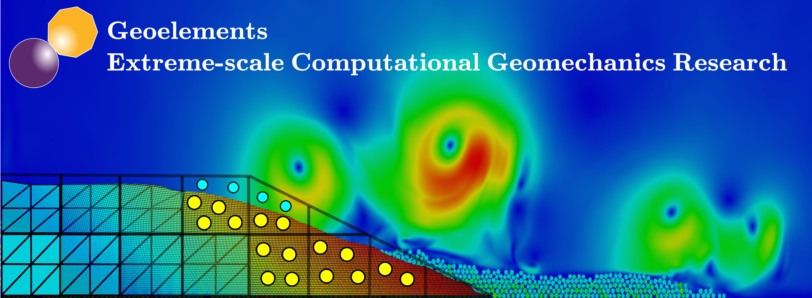

# [Geoelements Wiki](https://wiki.geoelements.org/)

We are an extreme-scale computational geomechanics research group based at UT Austin. Our research focus is on developing large-scale computational models to simulate natural hazards. It looks like you recently joined the Geoelements team in UT Austin’s Geotech group at Civil, Architectural, and Environemental Engineering department. That’s great! We’re really glad to have you here, and will do what we can to make your time in the research group amazing. We hope you’ll learn a lot about geomechanics, numerical methods and computational sciences, develop new skills (coding, data analysis, writing, giving talks), make new friends, and have a great deal of fun throughout the whole process.

This wiki was inspired by several others, and borrows heavily from them [Aly lab manual](https://github.com/alylab/labmanual/). It’s also a work in progress. If you have ideas about things to add, or what to clarify, talk to me (Krishna, the PI).

When you join the group, you’re expected to read this wiki. You’re also highly encouraged to read it while deciding if you want to join the group in the first place. You should always feel free to talk to Krishna to clarify anything in the wiki, and let him know if he isn’t following through on some of his promises! This wiki is intended to be a starting point for a positive mentor-mentee and research experience — but, ultimately, positive experiences will also require active investment in, and refinement of, our one-on-one interactions over time.

This lab manual is licensed under a [Creative Commons Attribution - NonCommercial 4.0 International License](https://creativecommons.org/licenses/by-nc/4.0/).

