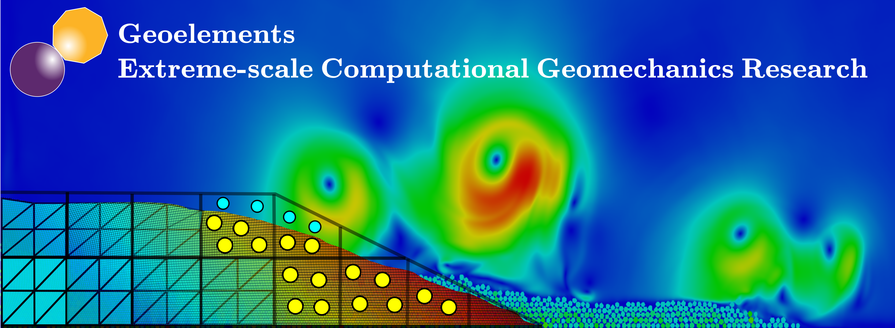

# [Geoelements Wiki](https://geoelements.org/wiki/)

We are an interdisciplinary research group at UT Austin focused on advancing AI and numerical methods for robotics and control. Our research combines cutting-edge techniques including Gaussian Splatting, Graph Neural Networks (GNNs), Material Point Method (MPM), and Reinforcement Learning (RL) to enable robots and autonomous systems to navigate and interact with complex, unstructured environments. It looks like you recently joined the Geoelements team at UT Austin's Oden Institute for Computational Sciences or Civil, Architectural, and Environmental Engineering department. That's great! We're really glad to have you here, and will do what we can to make your time in the research group amazing. We hope you'll learn a lot about AI, numerical methods, robotics, and control systems, develop new skills (coding, machine learning, data analysis, writing, giving talks), make new friends, and have a great deal of fun throughout the whole process.

When you join the group, you’re expected to read this wiki. You’re also highly encouraged to read it while deciding if you want to join the group in the first place. You should always feel free to talk to Krishna to clarify anything in the wiki, and let him know if he isn’t following through on some of his promises! This wiki is intended to be a starting point for a positive mentor-mentee and research experience — but, ultimately, positive experiences will also require active investment in, and refinement of, our one-on-one interactions over time.

This lab manual is licensed under a [Creative Commons Attribution - NonCommercial 4.0 International License](https://creativecommons.org/licenses/by-nc/4.0/). This wiki was inspired by several others, and borrows heavily from [Aly lab manual](https://github.com/alylab/labmanual/). It’s also a work in progress. If you have ideas about things to add, or what to clarify, talk to me (Krishna, the PI).

