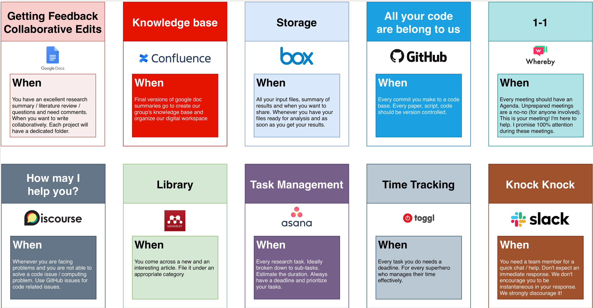

# Resources

## Bibliography and Reference Management (Mendeley/Zotero)
A lot of research gets published every day, and it can be hard to keep up. Use an RSS feed (e.g., [Feedly](https://feedly.com/i/welcome)) or subscribe to journal table of contents to keep up on the latest work. We mainly use [Google Scholar](https://scholar.google.com/) to find relevant articles, to store useful articles you will use a reference management system like [Mendeley](https://www.mendeley.com/) or [Zotero](https://www.zotero.org/). 
Reference or citation or bibliographic management software is tool for researchers to record and utilize bibliographic citations (references). [ConnectedPapers](https://www.connectedpapers.com/) is a great tool to find other related papers. Set-up a Google Scholar Email Alert on keywords related to your research to get notified when there is a new paper in the field. If you are outside of the University network and would like to get access, you may use EZ Proxy on [Firefox](https://addons.mozilla.org/en-US/firefox/addon/ezproxy-redirect-foxified/) or [Chrome](https://chrome.google.com/webstore/detail/ezproxy-redirect/gfhnhcbpnnnlefhobdnmhenofhfnnfhi?hl=en) to access PayWalled papers. Alternatively, tools such as [Unpaywall](https://unpaywall.org/) and [PaperPanda](https://paperpanda.app/) searches through publicly available archives for the paper. 

## Chat & Communication (Slack)
[Geoelements Slack](https://geoelements.slack.com) will be used as the primary means of lab communication. When posting messages or looking for updates, check the appropriate channel: `#general` for lab announcements, `#brain-trust` for communication related to BrainTrust meetings, `#papers` for sharing links to lab-relevant papers and discussing them, `#status-updates` for status updates, `#books-articles` for interesting books and articles you have read, `#conferences` for any relevant conference, and `#random` for non-work-related chatting that is best kept out of the work-related channels.

Try to keep each channel on topic, so that people can subscribe only to the channels that concern them. For messages to one person or a small group, use direct messages. If you have to send attachments (e.g., papers) or send messages that include out-of-lab recipients, use e-mail. If it’s an emergency and Krishna isn’t responding on Slack, e-mail him or call him if it is urgent.

Full-time lab members should install Slack on their computers. Do not install it on your phone, we do not expect everyone to be on Slack all the time. Treat Slack like emails as asynchronous communication system.

## Preprint (arXiv)
[arXiv](https://arxiv.org/a/kumar_3.html) is pre-print server to host versions of our manuscripts that we submit to journals and conferences. It is a way to promote Open Science and you are required to upload your manuscripts to arXiv and share the paper password with Krishna. 

## Scheduler (Calendly)
To book meetings with Krishna, use [Calendly](https://calendly.com/krishnakut/30min?). Make sure to update Asana with the meeting agenda and send all relevant documents to Krishna at least 2 hours before the meeting. 

## Task Management (Asana)
The lab's task management system is Asana (https://app.asana.com/), which should be used to manage all your tasks and projects. List every task you need to accomplish on Asana. Tasks should be managable entities, preferably less than 6 hours of work. If it takes longer, break it into subtasks. Provide weekly status updates on Asana. You can also assign tasks to Krishna if you like him to read through your documents/write-ups or review the code. 

## Time tracking (Toggl)
[Toggl](https://track.toggl.com/) is a time tracking tool, where you can label different activities and track how long you spend on each activity. I recommend estimating how long each activity will take and actually track it to see how well you did. Don't worry, initially you will be way off, but slowly your estimates will get better. Time tracking reports are a good way to review how well you spend your time on different activities. 

## Version control (Git and GitHub)
Git is a version control system that tracks changes and store your documents / input files and other important codes as repositories. A hosted version of Git is available for free (academic license) on GitHub.
The lab’s GitHub (https://github.com/geoelements) should be used to share code, docs, and wiki with the world. We develop open source code, so there is no embargo between code development and public accessibility. Always write tests and comments, because we don’t want to distribute buggy code to the world! Have other lab members check it if possible.

## Writing (Google Docs, OverLeaf & Obsidian)
Our group widely uses [Google docs](https://docs.google.com/) to record research activities, write draft papers, communicate ideas, create documentations and most importantly think about difficult problems. When you start in the group, you'll be provided a shared google drive link, use this to communicate all your research activities with Krishna. I also recommend using [Grammarly](https://www.grammarly.com/) to catch any grammar issues in your writing - use it a guideline, not everything Grammarly reports is an issue that needs fixing.

[OverLeaf](https://overleaf.com) is an online LaTeX (type-setting tool) editor for writing manuscripts and dissertations. We will exclusively use Google docs to edit/revise our manuscripts and transfer to LaTeX before submitting it for publication.

Markdown is a simple text format to take notes and document ideas/knowledge. [Obsidian](https://obsidian.md) is a knowledge base that works on local Markdown files to create a web of interlinked knowledge useful when taking notes. See [An introduction to Zettelkasten method](https://zettelkasten.de/introduction/) for taking smart notes.

## Storage (UT box / UT Austin DataVerse and DesignSafe)
The lab has a shared UT Box account that is used to store experiment data, so that you can run your experiment on any computer that has access to the lab UT Box folder. The lab UT Box is also used to store documents and files for general lab use (e.g., documents, papers, data, results, etc). Contact Krishna to get access to the lab UT Box.

Currently, the best option for sharing large datasets are the [UT Dataverse](https://dataverse.tdl.org/dataverse/utexas) or [DesignSafe CyberInfrastructure](https://designsafe-ci.org) for Natural Hazard Engineering datasets or for smaller datasets [Open Science Framework](https://osf.io). 

## Video conferencing (Whereby/Zoom)
Our video conferencing facility is accessible at [Geoelements Whereby](https://geoelements.whereby.com/meet). Use Firefox/Chrome browser for the best experience. 

Alternatively, we also use the [UT Zoom](https://utexas.zoom.us) account to have group calls. 

## Wiki
This Geoelements [wiki](https://github.com/geoelements/wiki) has all of the information you need to get started, including tasks that need to be done upon arrival, day-to-day housekeeping duties, forms and flyers, programming and modeling tips, information about accessing the high-performance computing clusters. Edit it when you obtain information that will be useful for others to know! You can also create wikis of your research documentation. Contact Krishna for further information.

